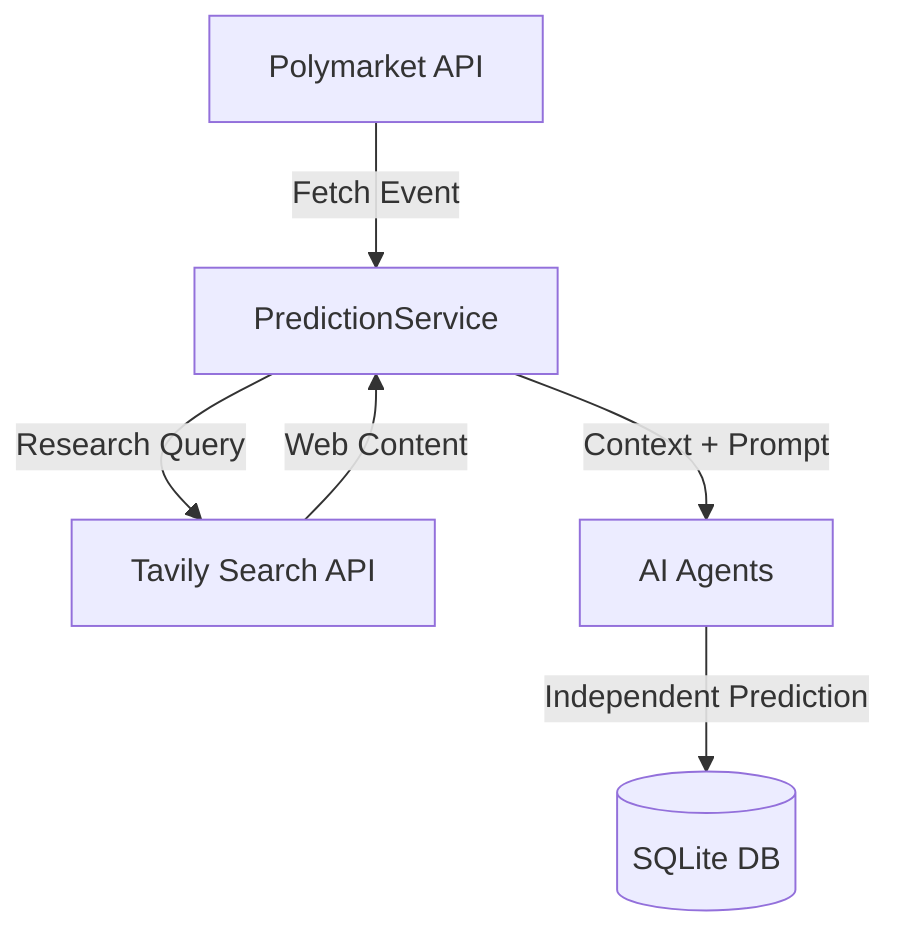
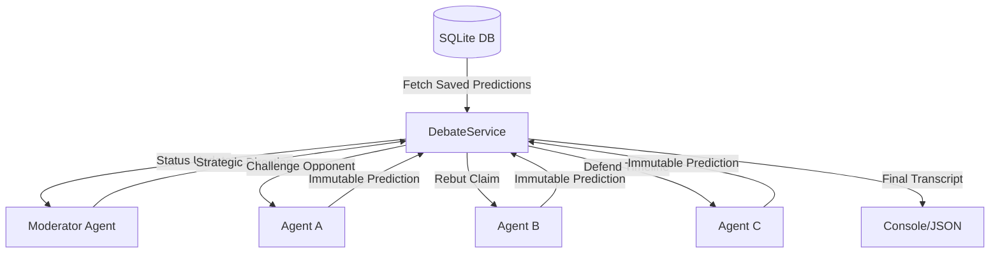

# AI Prediction Battle (Tech Events)

**AI Prediction Battle** is a recurring benchmark where multiple AI agents independently research and predict outcomes of tech-related Polymarket events. This system compares different AI research strategies (Precision vs. Signals vs. Constraints) using specialized LLM archetypes.

---

## 🏗️ System Architecture

### V0: Prediction Engine


### V1: Debate Engine

    subgraph "Agent Prediction Engine (V0)"
        AgentA[Agent A: ChatGPT - Precision]
        AgentB[Agent B: Grok - Early-Signal]
        AgentC[Agent C: Gemini - Constraint]
    end
    
    DB --> AgentA
    DB --> AgentB
    DB --> AgentC
    
    AgentA -->|Web Research| Tavily[Tavily Search API]
    AgentB -->|Web Research| Tavily
    AgentC -->|Web Research| Tavily
    
    AgentA -->|JSON Prediction| DB
    AgentB -->|JSON Prediction| DB
    AgentC -->|JSON Prediction| DB

    subgraph "Debate Engine (V1)"
        Moderator[Moderator Agent]
        AgentA <--> Moderator
        AgentB <--> Moderator
        AgentC <--> Moderator
    end
```

### Core Components
1. **Event Fetching Module**: Communicates with the Polymarket Gamma API to retrieve binary tech markets, resolution rules, and target dates.
2. **Persistence Layer**: An SQLite database (`predictions.db`) that stores every event, agent research context, and immutable predictions.
3. **Agent Orchestrator**: Handles the execution flow, ensuring agents research and predict independently without cross-leakage.
4. **Specialized Agents**:
   - **Agent A (ChatGPT - GPT-4o)**: Prioritizes official documentation and conservative probabilities.
   - **Agent B (Grok - Grok-Beta)**: Focuses on social sentiment, leaks, and early technical indicators on X.
   - **Agent C (Gemini - Gemini 1.5 Flash)**: Analyzes timeline feasibility, execution constraints, and historical precedents.

---

## 🌊 Execution Flow (Current)
1. **Initialization**: The system loads API keys from `.env` and checks which agents are available.
2. **Discovery**: A user provides a Polymarket Event ID (e.g., `36307`).
3. **Data Retrieval**: Market rules and details are pulled from Gamma API and cached in the DB.
4. **Independent Research**: Each active agent performs an "advanced" web search via Tavily based on their behavioral archetype.
5. **Prediction Generation**: Agents process the research results and output a structured JSON prediction (YES/NO + Probability).
6. **Persistence**: The predictions are locked into the database for scoring and future debate cycles.

---

## 🚀 Roadmap

### **V1: Text Debate Layer (Upcoming)**
*   **Moderator Agent**: A high-level LLM that identifies contradictions between agent predictions.
*   **Structured Turns**: Agents will challenge specific factual claims made by their opponents.
*   **Claim Rebuttals**: Agents can rebut challenges using new research if a contradiction is surfaced.
*   **Narrative Output**: A readable transcript of the "Battle" highlighting the core points of disagreement.

### **V2: Audio & Discovery (Future)**
*   **Voice Integration**: Each agent assigned a unique TTS (Text-to-Speech) voice for audio summaries.
*   **Automated Discovery**: Filter-based discovery of new tech events on Polymarket (e.g., liquidity > $100k, Category: "Tech").
*   **Visual Dashboard**: A web interface to view the long-term leaderboard of agent accuracy.

---

## 🛠️ Setup & Usage

### 1. Environment Secrets
Create a `.env` file with your API keys:
```env
OPENAI_API_KEY=...
XAI_API_KEY=...
GEMINI_API_KEY=...
TAVILY_API_KEY=...
```

### 2. Installation
```bash
pip install -r requirements.txt
```

### 3. Discover Tech Events
To see a list of active tech-related events and their IDs:
```bash
python main.py discover
```

### 4. Run a Battle (V0)
Run a prediction battle by providing an Event ID, Slug, or URL:
```bash
python main.py predict gpt-6-released-by
```

### 5. Start a Debate (V1)
Once predictions are locked in the database, trigger the debate layer:
```bash
python main.py debate gpt-6-released-by --rounds 3
```

---

## 🛠️ Agents & Archetypes

| Agent | Focus | Evidence Preference |
| :--- | :--- | :--- |
| **Agent A (ChatGPT)** | Precision | Official docs, primary sources |
| **Agent B (Grok)** | Early Signals | Social sentiment, leaks, experts |
| **Agent C (Gemini)** | Constraints | Historical precedents, feasibility |

---

## ⚖️ Legal & Positioning
- This system provides **probabilistic forecasts**, NOT betting advice.
- No real-money interaction or wagering.
- Global Disclaimer: *“This content is for informational and educational purposes only.”*
