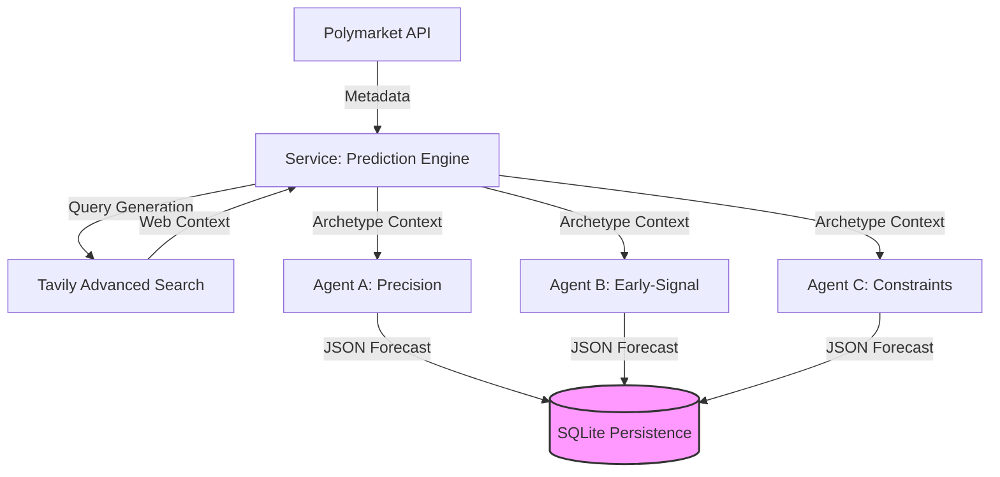

# 🎯 AI Prediction Battle (V0 Engine)

A high-fidelity multi-agent system designed to research and forecast outcomes for tech-related prediction markets on **Polymarket**. 

The V0 Engine focuses on **Agent Isolation and Research Integrity**—ensuring that multiple AI archetypes can independently analyze the same event and produce auditable, defensible probability forecasts without data leakage.

---

## 🏗️ Technical Architecture

### V0: Independent Research & Prediction Flow
The system enforces a strict "No-Communication" policy during the research phase. Each agent is a standalone instance with its own memory and research strategy.



---

## 🛠️ Specialized AI Archetypes
We differentiate agents by **research incentives** and **risk postures**, not personality.

| Profile | Strategy | Data Preference | Risk Posture |
| :--- | :--- | :--- | :--- |
| **Agent A** | Precision-Oriented | Primary sources, official docs, press releases | Conservative |
| **Agent B** | Early-Signal | Social sentiment, expert leaks, X (Twitter) signals | Aggressive |
| **Agent C** | Constraint-Oriented | Historical precedents, technical feasibility, regulatory | Moderate |

---

## 🚦 Getting Started

### 1. Environment Configuration
Create a `.env` file in the root directory. The system will automatically skip agents whose keys are missing.

```bash
# Research Access
TAVILY_API_KEY=tvly-xxxx

# Agent LLM Access
OPENAI_API_KEY=sk-xxxx
XAI_API_KEY=xai-xxxx
GEMINI_API_KEY=AIza-xxxx
```

### 2. Dependency Management
```bash
pip install -r requirements.txt
```

### 3. Usage: Running a Battle
Pass a manual **Polymarket Event ID** to trigger the engine.

```bash
python main.py predict [event_id]
```

*Example (2028 Election Market):*
```bash
python main.py predict 31552
```

---

## 📦 Core Component Manifest

*   **`PolymarketService`**: Interfaces with the Gamma API to resolve event rules and resolution dates.
*   **`PredictionService`**: Orchestrator that manages the lifecycle of the "Battle."
*   **`Isolated Agents`**: Subclasses of `BaseAgent` that execute archetypal-specific prompts.
*   **`Persistence Layer`**: SQLite database for **Locked Predictions**—once an agent predicts, the data is immutable and stored for future auditing.

---

## ⚖️ Legal Disclaimer
- This tool is for **informational and research purposes only.**
- It does not represent financial or betting advice.
- No real-money wagering or automated betting functionality is included.
